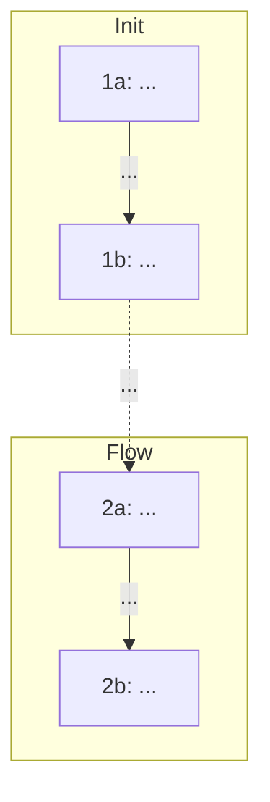

<additional_metadata>
NOTE: Open files and cursor position may not be related to the user's current request. Always verify relevance before assuming connection.

The USER presented this request to you on Dec 8, 2025 at 9:34pm, UTC+08:00.
</additional_metadata>
<mermaid_syntax>
When writing mermaid diagrams:
- Do NOT use spaces in node names/IDs. Use camelCase, PascalCase, or underscores instead.
  - Good: `UserService`, `user_service`, `userAuth`
  - Bad: `User Service`, `user auth`
- Do NOT use HTML tags like `<br/>` or `<br>` - they render as literal text or cause syntax errors.
  - Good: `participant FileSyncer as FS_TypeScript` or put details in notes
  - Bad: `participant FileSyncer as FileSyncer<br/>TypeScript`
- When edge labels contain parentheses, brackets, or other special characters, wrap the label in quotes:
  - Good: `A -->|\"O(1) lookup\"| B`
  - Bad: `A -->|O(1) lookup| B` (parentheses parsed as node syntax)
- Use double quotes for node labels containing special characters (parentheses, commas, colons):
  - Good: `A[\"Process (main)\"]`, `B[\"Step 1: Init\"]`
  - Bad: `A[Process (main)]` (parentheses parsed as shape syntax)
- Avoid reserved keywords as node IDs: `end`, `subgraph`, `graph`, `flowchart`
  - Good: `endNode[End]`, `processEnd[End]`
  - Bad: `end[End]` (conflicts with subgraph syntax)
- For subgraphs, use explicit IDs with labels in brackets: `subgraph id [Label]`
  - Good: `subgraph auth [Authentication Flow]`
  - Bad: `subgraph Authentication Flow` (spaces cause parsing issues)
- Avoid angle brackets and HTML entities in labels - they render as literal text:
  - Good: `Files[Files Vec]` or `Files[FilesTuple]`
  - Bad: `Files[\"Vec&lt;T&gt;\"]`
</mermaid_syntax>
<user_request>
make a mermaid diagram now. output it directly using ```mermaid. use node ids like \"1a:\" at the front of your node labels. use subgraphs and annotations.

**IMPORTANT: try to avoid making the diagram too linear**; something more like a hub and spoke topology is preferred. minimize super deep, long paths and prefer branching / breadth / shallow graphs.

show the non-trivial connections across traces; don't just connect the last node of the previous trace to the first node of the next trace.

If there are disconnected systems within the codemap, they should NOT be connected unnecessarily. Incorrect edges damage trust a lot and hurt accuracy.

label important edges (present tense). dont use emojis.

Example (format template; replace ids/labels/edges):



Keep subgraph titles short. Output format:
<thinking>
... // think about what edges should be highlighted. double check the tricky ones to make sure you don't include any incorrect ones.
</thinking>
```mermaid
...
```

</user_request>