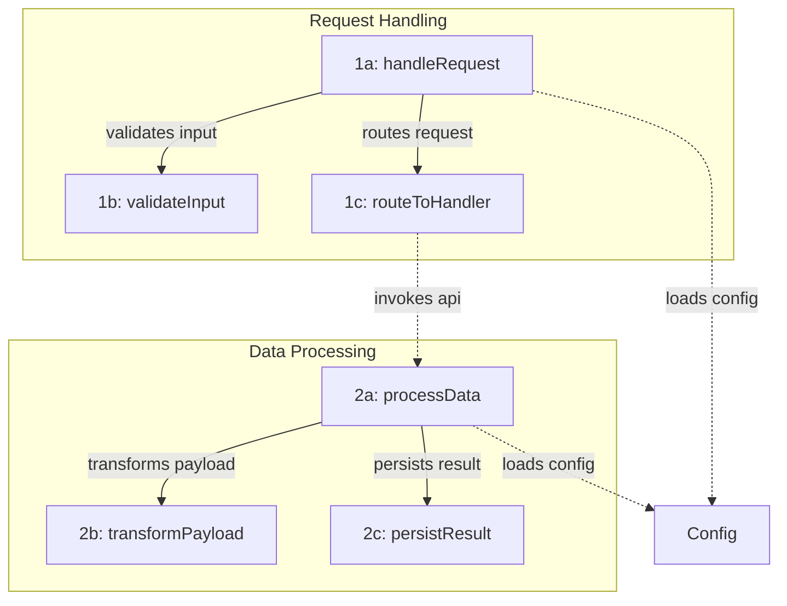

<additional_metadata>
NOTE: Open files and cursor position may not be related to the user's current request. Always verify relevance before assuming connection.

The USER presented this request to you on Dec 8, 2025 at 9:34pm, UTC+08:00.
</additional_metadata>
<mermaid_syntax>
When writing mermaid diagrams:
- Do NOT use spaces in node names/IDs. Use camelCase, PascalCase, or underscores instead.
  - Good: `UserService`, `user_service`, `userAuth`
  - Bad: `User Service`, `user auth`
- Do NOT use HTML tags like `<br/>` or `<br>` - they render as literal text or cause syntax errors.
  - Good: `participant FileSyncer as FS_TypeScript` or put details in notes
  - Bad: `participant FileSyncer as FileSyncer<br/>TypeScript`
- When edge labels contain parentheses, brackets, or other special characters, wrap the label in quotes:
  - Good: `A -->|\"O(1) lookup\"| B`
  - Bad: `A -->|O(1) lookup| B` (parentheses parsed as node syntax)
- Use double quotes for node labels containing special characters (parentheses, commas, colons):
  - Good: `A[\"Process (main)\"]`, `B[\"Step 1: Init\"]`
  - Bad: `A[Process (main)]` (parentheses parsed as shape syntax)
- Avoid reserved keywords as node IDs: `end`, `subgraph`, `graph`, `flowchart`
  - Good: `endNode[End]`, `processEnd[End]`
  - Bad: `end[End]` (conflicts with subgraph syntax)
- For subgraphs, use explicit IDs with labels in brackets: `subgraph id [Label]`
  - Good: `subgraph auth [Authentication Flow]`
  - Bad: `subgraph Authentication Flow` (spaces cause parsing issues)
- Avoid angle brackets and HTML entities in labels - they render as literal text:
  - Good: `Files[Files Vec]` or `Files[FilesTuple]`
  - Bad: `Files[\"Vec&lt;T&gt;\"]`
</mermaid_syntax>

<diagram_goal>
This diagram is for **onboarding compression**: helping someone unfamiliar with the code understand where to start and how pieces connect.

Show:
- **Entry points**: where execution starts for the user's request
- **Primary path**: the main flow from input to output
- **Coordinators**: nodes that dispatch to 3+ operations (hub-and-spoke)
- **Key artifacts**: data structures (AST, tokens, IR) when they clarify flow

Prioritize clarity and correctness over completeness.
Do NOT try to be exhaustive. A good diagram is a deliberate projection, not a dump.
</diagram_goal>

<structure_rules>
## Subgraphs
- One subgraph per trace, title ≤ 3 words
- Each trace should start with an entry candidate (the "start reading here" node)
- Disconnected systems in code = disconnected in diagram

## Shared Infrastructure
If the same utility/service is used by 2+ traces (logger, config, db pool):
- Show it once, outside all trace subgraphs
- Connect with dashed edges from traces that use it

## Shape Accuracy
- Linear pipelines stay linear (compiler: lex → parse → typecheck → codegen)
- Coordinators branch (don't fake sequence when it dispatches parallel operations)
- Don't force structure that doesn't match the code
</structure_rules>

<edge_semantics>
Edge types:
- `-->` : synchronous/direct calls within a trace
- `-.->` : async/events/callbacks OR cross-trace connections
- `==>` : primary flow emphasis (use sparingly, max 1 per trace)

Edge labels:
- 2-4 words, present-tense verb phrase
- Good: "parses tokens", "builds AST", "validates input"
- Bad: "runs the parser and builds the abstract syntax tree"
</edge_semantics>

<cross_trace_rules>
Cross-trace edges must represent real control transfer:
- Request handed to another subsystem
- Event/message published and consumed
- Job scheduled and executed
- Shared dependency accessed

All cross-trace edges must be dashed (`-.->`) and use a boundary verb ("invokes", "publishes", "enqueues").

If you cannot identify concrete evidence for a cross-trace connection, do not draw it.
</cross_trace_rules>

<user_request>
make a mermaid diagram now. output it directly using ```mermaid. use node ids like \"1a:\" at the front of your node labels. use subgraphs and annotations.

<thinking>
1. Identify the entry points (where does this start?)
2. Map the primary path through the code
3. Find coordinators (nodes with 3+ downstream operations)
4. Note shared infrastructure used by multiple traces
5. Check for disconnected systems that should NOT be linked
6. Verify each cross-trace edge has real evidence
</thinking>


Example (format template; replace ids/labels/edges):



Keep subgraph titles short. Output format:
<thinking>
... // think about what edges should be highlighted. double check the tricky ones to make sure you don't include any incorrect ones.
</thinking>
```mermaid
...
```

</user_request>